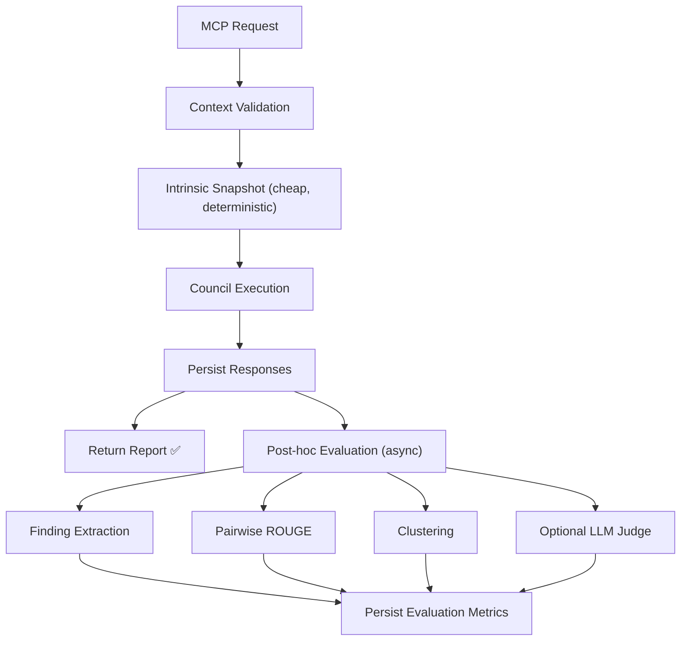

# Evaluation Layer Design — Council Report

> **Run ID:** `council_run_1782197368017_69c15d0e`
> **Status:** COMPLETED (3/3 providers: ChatGPT, Claude, Qwen)
> **Individual reports:** [quorum/council_report.md](file:///home/harry/Documents/Github-Projects/personal-projects/quorum-llm-council/quorum/council_report.md)

---

## 1. Architecture: Separate Evaluation Package

> [!IMPORTANT]
> All three council members agree: **do NOT extend `summaryEvaluation.ts` or `SummaryEvaluationMetrics`**. Context quality and response diversity are run-level evaluations, not defender-to-summary comparisons.

**Recommended structure:**

```
from_orchestrator/engine/evaluation/
  types.ts                  # Shared types, scores, configs
  contextQuality.ts         # Intrinsic + hindsight context metrics
  responseDiversity.ts      # Pairwise similarity, clustering, coverage
  findingExtraction.ts      # Parse structured findings from responses
  evaluationRunner.ts       # Orchestration entry point
```

**Public API boundary:**

```typescript
evaluateCouncilRun({
  runId: string,
  mode: 'council' | 'debate' | 'mcq',
  question: string,
  context: ValidatedCouncilContext,
  analyses: CouncilAnalysis[],
  voteDistribution?: McqVoteDistribution,
  debateTurns?: CouncilDebateTurn[]
})
```

---

## 2. Context Quality Metrics

> [!TIP]
> The council strongly recommends separating **intrinsic** (pre-dispatch) metrics from **hindsight** (post-response) metrics to avoid information leakage.

### Intrinsic Deterministic Metrics (compute at validation time, no LLM needed)

| Metric | Description |
|--------|-------------|
| `validation_warning_count` | Grouped by warning type |
| `missing_local_import_count` | From existing `addCompletenessWarnings()` |
| `referenced_file_coverage` | Files named in question that were supplied |
| `structured_review_field_coverage` | Populated fields / 9 |
| `structured_review_density` | Non-placeholder content per field |
| `notes_present` + `notes_length` | Descriptive, not quality-scored |
| `evidence_relevance_coverage` | Files with non-empty relevance / total files |
| `excerpt_ratio` | Excerpt files / total files |
| `project_scaffolding_coverage` | package.json, tsconfig.json, etc. present |
| `context_size_bytes`, `file_count` | Size metrics |
| `context_digest` | Immutable evaluation input identifier |

### Hindsight Post-Response Metrics (compute after council responses)

| Metric | Description |
|--------|-------------|
| `supported_finding_rate` | Findings with exact evidence resolving to supplied files |
| `unsupported_specific_claim_rate` | Technical claims without supplied evidence |
| `missing_context_request_rate` | Findings explicitly marked as lacking context |
| `repeated_missing_dependency_count` | Dependencies requested by ≥2 members |
| `unused_evidence_rate` | Supplied files never cited by any response |
| `evidence_concentration` | Share of findings using the most-cited source |

> [!WARNING]
> Qwen raises a key point: the existing `warnings[]` are plain strings, not structured objects. Refactoring `contextValidation.ts` to return typed warning objects (e.g., `{ type: 'missing_import', path: string }`) would enable reliable aggregation without regex parsing.

---

## 3. Diversity of Thought Metrics

### Step 1: Extract Normalized Findings

Before computing diversity, **parse responses into structured findings**:

```typescript
{
  classification: string,    // e.g., "Architectural risk"
  severity: string,          // e.g., "High"
  evidencePaths: string[],   // e.g., ["council.ts:23-29"]
  issueCategory: string,     // e.g., "architecture", "security"
  claim: string,             // The core concern
  recommendedAction: string,
  missingContext: string,
  validationTestCategory: string
}
```

Use deterministic contract parsing first. LLM extractor as fallback only for malformed responses.

### Step 2: Compute Metrics

#### Lexical & Semantic Overlap

| Metric | Description |
|--------|-------------|
| Pairwise ROUGE-1/2/L | **After stripping** contract boilerplate + quoted evidence |
| Pairwise embedding cosine | Optional, if embedding provider available |
| Similarity matrix | Full pairwise, not just mean |

#### Finding Uniqueness

| Metric | Description |
|--------|-------------|
| `unique_finding_ratio` | Distinct finding clusters / total findings |
| `member_novelty_rate` | Clusters unique to one member / that member's findings |
| `redundancy_rate` | Findings already raised by another member |
| `consensus_cluster_rate` | Clusters raised by ≥ configured % of members |
| `contradiction_pair_count` | Materially incompatible recommendations |

#### Coverage Breadth

| Metric | Description |
|--------|-------------|
| Category entropy | Over issue categories (architecture, security, testing, etc.) |
| Evidence-path breadth | How many source files are referenced |
| Classification/severity entropy | Distribution diversity |

#### Provider Differentiation

| Metric | Description |
|--------|-------------|
| Provider incremental coverage | New clusters when adding a provider |
| Leave-one-out coverage loss | Coverage drop when removing a provider |
| Provider-exclusive category rate | Categories only one provider surfaces |

> [!NOTE]
> **Agreement ≠ groupthink.** Independent convergence on evidence-backed findings is consensus, not necessarily a problem. Report both consensus and novelty.

---

## 4. Mode-Specific Evaluation

### Council Debate

- Measure primary diversity in **analysis phase only**
- `critique_novelty`: new clusters introduced during critique
- `rebuttal_update_rate`: claims changed after criticism
- `convergence_delta`: similarity change analysis → decision
- `independent_persistence`: unique findings retained through final decision

### MCQ Voting

- **Vote entropy** and **effective number of options** (`exp(entropy)`)
- Majority concentration, unanimity rate, abstention rate
- **Rationale diversity separately from choice diversity** — unanimous votes with distinct rationales ≠ low diversity

---

## 5. Persistence: New DB Tables

### `CouncilEvaluationRuns`
```sql
evaluation_id TEXT PRIMARY KEY,
run_id TEXT NOT NULL REFERENCES Runs(run_id),
evaluation_version TEXT NOT NULL,
status TEXT NOT NULL,    -- PENDING | COMPLETED | PARTIAL | SKIPPED | FAILED
mode TEXT NOT NULL,      -- council | debate | mcq
context_digest TEXT,
started_at TIMESTAMP,
completed_at TIMESTAMP,
trigger TEXT,            -- inline | posthoc | manual
evaluator_provider TEXT,
evaluator_task_id TEXT,
config_json TEXT,
error_json TEXT
```

### `ContextQualityMetrics`
```sql
evaluation_id TEXT PRIMARY KEY REFERENCES CouncilEvaluationRuns(evaluation_id),
warning_count INTEGER, missing_import_count INTEGER,
referenced_file_coverage REAL, structured_field_coverage REAL,
evidence_relevance_coverage REAL, excerpt_ratio REAL,
project_scaffolding_coverage REAL,
supported_finding_rate REAL,     -- nullable (hindsight)
missing_context_request_rate REAL,
unused_evidence_rate REAL,
metrics_json TEXT                 -- extensible overflow
```

### `CouncilDiversityMetrics`
```sql
evaluation_id TEXT PRIMARY KEY REFERENCES CouncilEvaluationRuns(evaluation_id),
member_count INTEGER, valid_response_count INTEGER,
finding_count INTEGER, finding_cluster_count INTEGER,
unique_finding_ratio REAL, consensus_cluster_rate REAL,
mean_pairwise_rouge1 REAL, mean_pairwise_rouge2 REAL, mean_pairwise_rouge_l REAL,
mean_semantic_similarity REAL,   -- nullable
category_entropy REAL, evidence_path_breadth INTEGER,
provider_incremental_coverage_json TEXT,
metrics_json TEXT
```

### Optional Detail Tables
- `CouncilResponsePairMetrics` — per task-pair ROUGE/similarity
- `CouncilFindingClusters` — normalized finding clusters
- `CouncilFindingMembership` — cluster ↔ task mapping
- `CouncilContextEvidenceUsage` — finding ↔ evidence ID mapping

---

## 6. Execution Strategy

> [!IMPORTANT]
> **Post-hoc by default.** Blocking council results on evaluation adds latency and makes successful consultations fail due to auxiliary evaluation failures.

### Recommended execution flow:



- **Inline mode** available for CI/benchmarking: `evaluationMode: 'inline' | 'posthoc' | 'disabled'`
- Evaluation status (`PENDING`/`COMPLETED`/`FAILED`) is independent of consultation status

---

## 7. Meta-Circularity: LLM-as-Judge Guardrails

**Hierarchy of authority (most trusted → least):**

1. **Deterministic structural/static-analysis metrics** — warning counts, import checks
2. **Deterministic lexical metrics** — ROUGE, boilerplate detection
3. **Embedding/clustering** — frozen model/version, reproducible thresholds
4. **LLM judgments** — only for semantic questions that can't be resolved mechanically

**LLM judge guardrails:**
- Use a provider **not** in the evaluated council when possible
- Blind provider identity, randomize response order
- Narrow rubric per dimension (not one holistic score)
- Persist raw judgment + model/provider + prompt version
- Track judge disagreement across duplicate runs
- Maintain a human-labeled benchmark set
- **Never use judge score as sole deployment gate**

---

## 8. Implementation Sequence

| Phase | What | LLM Required? |
|-------|------|:-:|
| 1 | Evaluation types + deterministic context metrics | ❌ |
| 2 | Structured finding parsing with explicit failures | ❌ |
| 3 | Pairwise lexical metrics + finding clustering | ❌ |
| 4 | New DB tables + persistence | ❌ |
| 5 | JSON evaluation artifact + report section | ❌ |
| 6 | Post-hoc execution without changing consultation status | ❌ |
| 7 | Optional semantic embeddings + LLM judges | ✅ |
| 8 | Calibrate against human-labeled corpus | ✅ |

> [!CAUTION]
> **Do not introduce composite scores before calibration.** Surface a multi-dimensional scorecard first. Introduce weighted composites only after correlation with human evaluation is established.

---

## Key Open Decisions

1. **Should `contextValidation.ts` be refactored to return structured warning objects?** (vs. parsing strings)
2. **Should `CouncilConsultationResult` be extended with a structured `contextEvaluation` field?** (vs. warnings-only)
3. **O(N²) avoidance:** Use ROUGE pairwise (deterministic, cheap) or single-call LLM clustering for diversity?
4. **Durable post-hoc execution:** Is the current process lifecycle sufficient, or does this need a worker/queue?
5. **Evaluation as its own MCP tool?** (e.g., `evaluate_council_run` to re-run evaluation on past runs)
