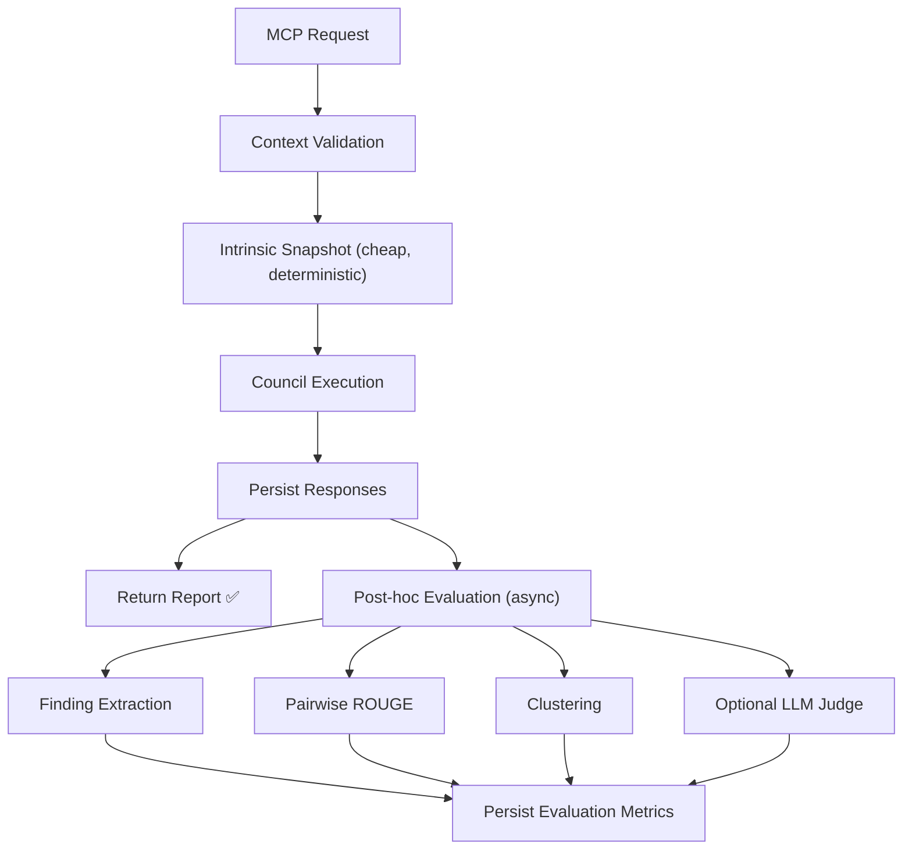

# Evaluation Layer Design — Council Report

> **Run ID:** `council_run_1782197368017_69c15d0e`
> **Status:** COMPLETED (3/3 providers: ChatGPT, Claude, Qwen)
> **Individual reports:** [quorum/council_report.md](file:///home/harry/Documents/Github-Projects/personal-projects/quorum-llm-council/quorum/council_report.md)

---

## 1. Architecture: Separate Evaluation Package

> [!IMPORTANT]
> All three council members agre## Finding 1 — Separate evaluation orchestration from existing summary-faithfulness evaluation

**Classification:** Architectural risk
**Severity:** High
**Confidence:** High
**Exact path:line evidence:**

* `from_orchestrator/engine/summaryEvaluation.ts:23-40` — the module is explicitly organized around evaluating defender claims against a final synthesis and persisting `SummaryEvaluationMetrics`.
* `from_orchestrator/db/database.ts:6` — the existing table is defender/synthesis-specific, including `summary_task_id`, `defender_task_id`, omission, distortion, contradiction, and verdict fields.
* `from_orchestrator/engine/council.ts:23-29` — ordinary consultations return a report, warnings, and independent analyses without a synthesis-evaluation abstraction.

**Reasoning:**
Context quality and response diversity are run-level or council-stage evaluations, not defender-to-summary comparisons. Extending `summaryEvaluation.ts` or `SummaryEvaluationMetrics` would mix distinct evaluation units and create nullable or semantically misleading columns.

Use a separate evaluation package, for example:

```text
from_orchestrator/engine/evaluation/
  types.ts
  contextQuality.ts
  responseDiversity.ts
  findingExtraction.ts
  evaluationRunner.ts
```

Keep `summaryEvaluation.ts` as the synthesis-faithfulness evaluator. Shared deterministic utilities such as normalization, pairwise scoring, and evaluator JSON parsing may move into the new package if both systems use them.

A practical public boundary would be:

```ts
evaluateCouncilRun({
  runId,
  mode,
  question,
  context,
  analyses,
  voteDistribution?,
  debateTurns?
})
```

The dimension-specific evaluators should remain callable independently for testing and selective configuration.

**Missing context:**
The actual module-export conventions, configuration layout, database migration mechanism, and whether engine subdirectories are currently used are omitted.

**Validation test:**
Add an architecture-level test that imports and runs context-quality and diversity evaluation without importing or creating a `SummaryEvaluationMetrics` record. Verify existing summary-evaluation tests remain unchanged and continue writing only synthesis-faithfulness metrics.

---

## Finding 2 — Context evaluation must distinguish intrinsic context quality from hindsight usefulness

**Classification:** Architectural risk
**Severity:** High
**Confidence:** High
**Exact path:line evidence:**

* `from_orchestrator/mcp/contextValidation.ts:26-31` — validation already checks path safety, hashes, staleness, missing local imports, missing project configuration, and files named in the question.
* `from_orchestrator/engine/council.ts:42-70` — council prompts receive notes, structured-review fields, warnings, the digest, and repository evidence.
* `from_orchestrator/engine/council.ts:99-118` — repository evidence includes path, hash, role, provenance, relevance, ranges, excerpt status, and content.

**Reasoning:**
There are two different questions:

1. **Pre-dispatch intrinsic quality:** Is the submitted context internally complete, valid, focused, and well structured?
2. **Post-response usefulness:** Did the supplied context support the findings that reviewers actually made, and did reviewers repeatedly request the same missing evidence?

Combining these into one score would create hindsight leakage. A context may be well assembled from information available to the caller but still miss a dependency discovered only during review.

Recommended metrics:

### Intrinsic deterministic metrics

* `validation_warning_count`, grouped by warning type.
* `missing_local_import_count`.
* `referenced_file_coverage`: files explicitly named in the question that were supplied.
* `structured_review_field_coverage`: populated required fields divided by nine.
* `structured_review_density`: non-placeholder content per field, with upper and lower bounds.
* `notes_present` and `notes_length`, reported descriptively rather than treated as quality alone.
* `evidence_relevance_coverage`: proportion of files with non-empty relevance.
* `excerpt_ratio`: excerpt files divided by supplied files.
* `excerpt_boundary_risk_count`: excerpts whose local imports or cited symbols fall outside included ranges, where statically detectable.
* `project_scaffolding_coverage`: presence of relevant `package.json`, `tsconfig.json`, schemas, interfaces, tests, or configuration when referenced by supplied files.
* `context_size_bytes`, `file_count`, and duplication ratio.
* `context_digest` as the immutable evaluation input identifier.

### Post-response metrics

* `supported_finding_rate`: findings with exact evidence that resolves to supplied evidence.
* `unsupported_specific_claim_rate`: specific technical claims without supplied evidence.
* `missing_context_request_rate`: findings explicitly marked as lacking context.
* `repeated_missing_dependency_count`: dependencies independently requested by multiple members.
* `unused_evidence_rate`: supplied files never cited or semantically used by any response.
* `evidence_concentration`: share of findings supported by the most-used source.
* `context_sufficiency_judge_score`, as an optional LLM judgment rather than the primary score.

Store the intrinsic and hindsight sections separately. Do not collapse them into a single “context quality” number until weights have been calibrated against human judgments.

**Missing context:**
The exact warning representation is unavailable. It is unclear whether warnings are typed codes or only strings, and whether response evidence follows a reliably parseable format.

**Validation test:**
Construct two fixtures:

* A context with all referenced files and imports but no reviewer responses.
* A context missing an imported interface that every reviewer later requests.

Verify the first receives only intrinsic metrics. Verify the second records both the pre-dispatch missing-import signal and a separate post-response repeated-missing-context signal without double-counting them as one metric.

---

## Finding 3 — The reviewer contract makes finding-level diversity feasible, but raw response text is insufficient

**Classification:** Hardening recommendation
**Severity:** High
**Confidence:** High
**Exact path:line evidence:**

* `from_orchestrator/engine/council.ts:80-87` — every finding is required to include classification, severity, confidence, exact evidence, reasoning, missing context, and a validation test.
* `from_orchestrator/engine/council.ts:31-35` — `CouncilAnalysis` currently stores only provider, task ID, and unstructured response text.
* `from_orchestrator/engine/rouge.ts:3-6` — existing similarity is lexical token, n-gram, and longest-common-subsequence overlap.

**Reasoning:**
ROUGE over complete responses will overestimate groupthink when members quote the same repository evidence or repeat the required output headings. It will underestimate conceptual agreement when providers use different wording.

Parse or extract normalized findings before computing substantive diversity. A normalized finding should contain:

```text
classification
severity
evidence paths and line ranges
issue category
claim or concern
recommended action
missing-context request
validation-test category
```

Use deterministic contract parsing first. For malformed responses, retain a parse status and optionally invoke an LLM extractor whose output must conform to a schema. Keep the original response unchanged for auditability.

Recommended diversity metrics:

### Lexical and semantic overlap

* Pairwise ROUGE-1, ROUGE-2, and ROUGE-L after removing contract boilerplate and quoted evidence.
* Pairwise embedding cosine similarity, if an embedding provider is available.
* Similarity median, maximum, dispersion, and pairwise matrix rather than only a mean.

### Finding uniqueness

* `unique_finding_ratio`: distinct normalized finding clusters divided by total findings.
* `member_novelty_rate`: clusters introduced by exactly one member divided by that member’s findings.
* `redundancy_rate`: findings assigned to clusters already raised by another member.
* `consensus_cluster_rate`: clusters independently raised by a configured proportion of members.
* `contradiction_pair_count`: materially incompatible recommendations or diagnoses.

### Coverage breadth

* Number and entropy of issue categories, such as correctness, architecture, security, persistence, concurrency, testing, operability, and privacy.
* Evidence-path breadth and evidence-line breadth.
* Validation-strategy breadth: unit, integration, migration, property, concurrency, failure-injection, and manual inspection.
* Classification and severity distribution entropy.

### Provider differentiation

* Provider-category association, reported only with adequate sample sizes.
* Provider-exclusive category rate.
* Provider incremental coverage: new clusters contributed when adding that provider to the council.
* Leave-one-provider-out coverage loss.

Do not interpret all agreement as undesirable. Agreement on independently discovered, evidence-backed defects is consensus, not necessarily groupthink. Report both consensus and novelty.

**Missing context:**
No actual reviewer-response samples or parser implementation are supplied. Embedding infrastructure and allowed external model calls are unknown.

**Validation test:**
Use three synthetic responses:

1. Same finding with nearly identical wording.
2. Same finding paraphrased with different wording.
3. Different finding quoting the same source lines.

Verify lexical scoring detects case 1, semantic or normalized clustering combines case 2, and finding extraction keeps case 3 separate despite shared evidence.

---

## Finding 4 — ROUGE should be retained only as one diversity signal

**Classification:** Hardening recommendation
**Severity:** Medium
**Confidence:** High
**Exact path:line evidence:**

* `from_orchestrator/engine/rouge.ts:1-6` — the implementation exposes ROUGE-1, ROUGE-2, and ROUGE-L based on normalized tokens, n-grams, and LCS.
* `from_orchestrator/engine/summaryEvaluation.ts:36-40` — ROUGE is already persisted alongside claim-level evaluator scores rather than being the sole evaluation.

**Reasoning:**
The existing pattern correctly treats ROUGE as supplementary. Apply the same principle to diversity.

Before comparison:

* Remove the required reviewer-format labels.
* Remove or replace source excerpts and repeated `path:line` evidence with canonical evidence IDs.
* Normalize classification and severity labels.
* Compare findings individually as well as whole responses.
* Retain response-length and finding-count differences so concise members are not falsely classified as highly novel.

ROUGE is useful for detecting copied phrasing and near-duplicate responses. It cannot establish independent reasoning or conceptual uniqueness.

**Missing context:**
The full `rouge.ts` implementation and its behavior for empty strings, very short responses, Unicode, and code tokens are omitted.

**Validation test:**
Add cases for empty responses, one-token findings, repeated boilerplate, code identifiers, and identical source quotations. Verify no `NaN` values occur and boilerplate-stripped similarity is lower than raw-response similarity where only headings are shared.

---

## Finding 5 — Persist evaluations in run-level records plus normalized detail tables

**Classification:** Hardening recommendation
**Severity:** High
**Confidence:** High
**Exact path:line evidence:**

* `from_orchestrator/db/database.ts:2-8` — persistence already separates runs, tasks, lineage, telemetry, evaluation metrics, artifacts, and node invocations.
* `from_orchestrator/db/database.ts:6` — `SummaryEvaluationMetrics` is a specialized, detailed metrics table.
* `from_orchestrator/db/database.ts:7` — artifacts can store typed JSON content associated with runs and nodes.
* `from_orchestrator/engine/summaryEvaluation.ts:36-40` — evaluation writes metric fields together with evaluator provider, evaluator task, raw JSON, and rationale.

**Reasoning:**
Use new tables rather than extending `SummaryEvaluationMetrics`.

A workable schema is:

### `CouncilEvaluationRuns`

One record per evaluation execution:

```text
evaluation_id
run_id
evaluation_version
status
mode
context_digest
started_at
completed_at
trigger
evaluator_provider
evaluator_task_id
config_json
error_json
```

### `ContextQualityMetrics`

One record per evaluated council invocation:

```text
evaluation_id
intrinsic_score nullable
hindsight_score nullable
warning_count
missing_import_count
referenced_file_coverage
structured_field_coverage
evidence_relevance_coverage
excerpt_ratio
project_scaffolding_coverage
supported_finding_rate
missing_context_request_rate
unused_evidence_rate
metrics_json
```

### `CouncilDiversityMetrics`

Aggregate record:

```text
evaluation_id
member_count
valid_response_count
finding_count
finding_cluster_count
unique_finding_ratio
consensus_cluster_rate
mean_pairwise_rouge1
mean_pairwise_rouge2
mean_pairwise_rouge_l
mean_semantic_similarity nullable
category_entropy
evidence_path_breadth
provider_incremental_coverage_json
metrics_json
```

### Optional detailed tables

* `CouncilResponsePairMetrics` for each task pair.
* `CouncilFindingClusters` for normalized clusters.
* `CouncilFindingMembership` linking clusters to task IDs.
* `CouncilContextEvidenceUsage` linking findings to evidence IDs.

Detailed rows make metric recalculation and debugging possible. Store the full evaluation report as an `Artifacts` entry, for example `artifact_type = 'council_evaluation_report_v1'`. Use task IDs internally and reviewer labels or anonymous member indices in surfaced reports.

Include an explicit `evaluation_version`; metric definitions and clustering thresholds will change.

**Missing context:**
The full database schema, foreign-key conventions, migration process, JSON-column conventions, and transaction methods are omitted.

**Validation test:**
Run a migration test against an existing database fixture. Confirm prior `SummaryEvaluationMetrics` records remain readable, all new foreign keys resolve to the intended run and tasks, duplicate evaluation retries are idempotent, and a failed detail insertion rolls back the aggregate record.

---

## Finding 6 — Evaluation should be post-hoc by default, with a small deterministic inline snapshot

**Classification:** Architectural risk
**Severity:** High
**Confidence:** High
**Exact path:line evidence:**

* `from_orchestrator/engine/council.ts:23-29` — consultation completion returns the direct report and analyses.
* `from_orchestrator/engine/council.ts:74-77` — direct-report construction requires only completed analyses.
* `from_orchestrator/engine/summaryEvaluation.ts:29-40` — the established evaluator invokes additional model work after synthesis and persists results without contributing to synthesis construction.
* `from_orchestrator/engine/councilDebate.ts:5-7` — debate evaluation may require completed phases and cross-turn information.

**Reasoning:**
Blocking the council result on diversity clustering or an LLM judge increases latency and makes an otherwise successful consultation fail because auxiliary evaluation failed.

Recommended execution policy:

1. **At request validation:** Compute and persist a cheap deterministic context snapshot: digest, warning counts, file counts, structured-field coverage, import checks, size, and manifest statistics.
2. **After responses are persisted:** Mark the council run complete and return its normal report.
3. **Post-hoc evaluation node:** Compute evidence usage, finding extraction, pairwise similarities, clustering, provider contribution, and optional LLM judgments.
4. **Independent status:** Evaluation may be `PENDING`, `COMPLETED`, `PARTIAL`, `SKIPPED`, or `FAILED` without modifying the consultation’s success status.

The lineage model can represent evaluation as a child node of the completed council tasks. Artifacts and node invocations already provide concepts suitable for this separation.

A synchronous mode may remain available for benchmarking or CI, but it should be explicit, such as `evaluationMode: 'inline' | 'posthoc' | 'disabled'`.

“Post-hoc” must correspond to a durable execution mechanism. A detached promise inside the MCP process risks being lost when the process exits. The supplied evidence does not show whether a worker or resumable node executor exists.

**Missing context:**
The omitted runner, node execution, and server lifecycle code prevents verification that durable asynchronous execution is currently available.

**Validation test:**
Force the evaluator provider to time out after all council responses succeed. Verify the consultation remains `COMPLETED`, its report is returned, and only the evaluation record becomes `FAILED` or `PARTIAL`. Restart the process between consultation completion and evaluation to verify durable resumption if post-hoc execution is claimed.

---

## Finding 7 — Debate and MCQ require mode-specific diversity metrics

**Classification:** Hardening recommendation
**Severity:** Medium
**Confidence:** High
**Exact path:line evidence:**

* `from_orchestrator/engine/councilDebate.ts:2-7` — debate turns record phase, round, response, and input task IDs across analysis, critique, rebuttal, and decision.
* `from_orchestrator/engine/mcq.ts:2-9` — MCQ mode already exposes valid votes, failures, abstentions, vote counts, vote fractions, and voters.

**Reasoning:**
A single diversity definition would conflate independent analysis with deliberate convergence.

For debate:

* Measure primary diversity only in the initial `analysis` phase.
* Measure `critique_novelty`: new clusters introduced during critique.
* Measure `rebuttal_update_rate`: claims changed after criticism.
* Measure `convergence_delta`: similarity change from analysis to decision.
* Measure `independent_persistence`: unique findings retained through final decisions.
* Use `inputTaskIds` to distinguish expected influence from suspicious copying.

For MCQ:

* Vote entropy.
* Effective number of options: `exp(entropy)`.
* Majority concentration.
* Unanimity rate.
* Abstention and invalid-response rates.
* Provider vote stability across repeated or perturbed trials, when available.
* Rationale diversity separately from choice diversity.

Unanimous MCQ votes can be correct consensus. They should not automatically produce a poor diversity score.

**Missing context:**
The actual debate prompts, whether members can see all prior turns, MCQ rationale schema, and provider ordering are not supplied.

**Validation test:**
Create an MCQ fixture with unanimous votes but distinct evidence-backed rationales and another with split votes but copied rationales. Verify choice diversity and rationale diversity are reported separately. For debate, verify initial-analysis diversity is unaffected by expected convergence in the decision phase.

---

## Finding 8 — LLM judges must be calibrated and must not own deterministic metrics

**Classification:** Architectural risk
**Severity:** High
**Confidence:** High
**Exact path:line evidence:**

* `from_orchestrator/engine/summaryEvaluation.ts:23-27` — the existing system already builds an evaluator prompt and parses structured scoring.
* `from_orchestrator/engine/summaryEvaluation.ts:34-40` — evaluation uses a configured evaluator provider, retains evaluator task identity and JSON, and also computes deterministic ROUGE.
* `from_orchestrator/db/database.ts:6` — evaluator provider, evaluator task, raw response JSON, and rationale are persisted for auditability.

**Reasoning:**
The meta-circularity problem cannot be eliminated, but it can be bounded.

Use this order of authority:

1. Deterministic structural and static-analysis metrics.
2. Deterministic lexical metrics.
3. Embedding or clustering metrics with frozen model/version and thresholds.
4. LLM judgments only for semantic questions that cannot be resolved mechanically.

For LLM judgments:

* Use a provider not represented in the evaluated council when feasible.
* Blind provider identity and member order.
* Randomize response order.
* Evaluate each dimension with a narrow rubric rather than asking for one holistic score.
* Require evidence references and structured JSON.
* Persist raw judgment, model/provider, prompt version, temperature or decoding configuration where available.
* Run duplicate judgments on a calibrated sample.
* Track judge disagreement.
* Maintain a human-labeled benchmark set.
* Report confidence intervals and sample sizes for aggregate provider comparisons.
* Never use the judge’s composite score as the sole deployment gate.

For context quality, ask the judge to identify missing evidence and explain why it was necessary, not merely assign a number. For diversity, ask it to cluster claims and label relationships such as duplicate, extension, contradiction, or independent.

**Missing context:**
Provider sampling controls, deterministic decoding support, model version recording, and access to human-review workflows are not shown.

**Validation test:**
Prepare a human-labeled benchmark containing duplicate, paraphrased, complementary, and contradictory findings. Run the judge with permuted member order and anonymized labels. Measure cluster agreement, score variance, and ordering sensitivity. Fail calibration if materially different scores result solely from response order or provider labels.

---

## Finding 9 — Composite scores should not be introduced before calibration

**Classification:** Hardening recommendation
**Severity:** Medium
**Confidence:** High
**Exact path:line evidence:**

* `from_orchestrator/engine/summaryEvaluation.ts:15-20` — the existing evaluation exposes multiple interpretable scores and counts rather than only one opaque total.
* `from_orchestrator/db/database.ts:6` — the database preserves individual dimensions, counts, ROUGE metrics, and rationale.

**Reasoning:**
Follow the existing multidimensional pattern. Initially surface a scorecard rather than one “quality score.”

Suggested result shape:

```text
Context quality
  Intrinsic completeness
  Focus/relevance
  Evidence integrity
  Post-review sufficiency

Thought diversity
  Consensus
  Novelty
  Coverage breadth
  Contradiction
  Provider incremental contribution
```

A later composite may be computed from versioned weights after correlation with human evaluation is established. Without calibration, weighting missing imports against unused files or consensus against novelty would be arbitrary.

**Missing context:**
No target use case is specified for the scores: observability, regression detection, provider selection, caller feedback, or release gating. Each requires different thresholds.

**Validation test:**
Have human reviewers rank a representative sample of council runs. Measure correlation for each metric independently. Introduce a composite only when its out-of-sample correlation and stability exceed the best individual metric and document the versioned weighting.

---

## Finding 10 — The supplied excerpts are insufficient to identify exact integration points

**Classification:** Unverifiable
**Severity:** Medium
**Confidence:** High
**Exact path:line evidence:**

* `from_orchestrator/engine/council.ts:1-119` — prompt and report helpers are shown, but the consultation execution body is absent.
* `from_orchestrator/engine/summaryEvaluation.ts:29-40` — only a summarized function body is supplied.
* `from_orchestrator/db/database.ts:1-9` — only a schema summary is supplied.
* `from_orchestrator/mcp/contextValidation.ts:26-32` — validation behavior is described, but warning representation and implementation are omitted.

**Reasoning:**
The precise call site, transaction boundary, configuration additions, migration APIs, and durable post-hoc scheduling mechanism cannot be established from the provided repository evidence. Naming exact functions to edit beyond the visible APIs would be speculative.

The likely integration boundaries are:

* Immediately after context validation for the intrinsic snapshot.
* Immediately after all member tasks are persisted for response evaluation.
* A new child node or artifact for post-hoc reports.
* MCP result metadata or a separate retrieval tool for surfacing completed evaluation.

These are implementation options, not confirmed repository facts.

**Missing context:**
Full `council.ts`, `mcq.ts`, `councilDebate.ts`, `database.ts`, configuration module, MCP tool registration, artifact report generation, and worker/resumption infrastructure.

**Validation test:**
Trace one consultation from MCP handler through validation, task persistence, report return, and process shutdown. Identify the last transaction-safe point before response delivery and determine whether a durable node can be enqueued there. Repeat for direct council, MCQ, and debate modes.

---

## Recommended implementation sequence

1. Add versioned evaluation types and deterministic context metrics.
2. Add structured finding parsing with explicit parse failures.
3. Add pairwise lexical metrics and finding clustering.
4. Add new run-level and detail persistence tables.
5. Emit a JSON evaluation artifact and a concise anonymous report section.
6. Integrate post-hoc execution without changing consultation status.
7. Add optional semantic embeddings and LLM judges.
8. Calibrate against a human-labeled corpus before introducing thresholds or composite scores.
e: **do NOT extend `summaryEvaluation.ts` or `SummaryEvaluationMetrics`**. Context quality and response diversity are run-level evaluations, not defender-to-summary comparisons.

**Recommended structure:**

```
from_orchestrator/engine/evaluation/
  types.ts                  # Shared types, scores, configs
  contextQuality.ts         # Intrinsic + hindsight context metrics
  responseDiversity.ts      # Pairwise similarity, clustering, coverage
  findingExtraction.ts      # Parse structured findings from responses
  evaluationRunner.ts       # Orchestration entry point
```

**Public API boundary:**

```typescript
evaluateCouncilRun({
  runId: string,
  mode: 'council' | 'debate' | 'mcq',
  question: string,
  context: ValidatedCouncilContext,
  analyses: CouncilAnalysis[],
  voteDistribution?: McqVoteDistribution,
  debateTurns?: CouncilDebateTurn[]
})
```

---

## 2. Context Quality Metrics

> [!TIP]
> The council strongly recommends separating **intrinsic** (pre-dispatch) metrics from **hindsight** (post-response) metrics to avoid information leakage.

### Intrinsic Deterministic Metrics (compute at validation time, no LLM needed)

| Metric | Description |
|--------|-------------|
| `validation_warning_count` | Grouped by warning type |
| `missing_local_import_count` | From existing `addCompletenessWarnings()` |
| `referenced_file_coverage` | Files named in question that were supplied |
| `structured_review_field_coverage` | Populated fields / 9 |
| `structured_review_density` | Non-placeholder content per field |
| `notes_present` + `notes_length` | Descriptive, not quality-scored |
| `evidence_relevance_coverage` | Files with non-empty relevance / total files |
| `excerpt_ratio` | Excerpt files / total files |
| `project_scaffolding_coverage` | package.json, tsconfig.json, etc. present |
| `context_size_bytes`, `file_count` | Size metrics |
| `context_digest` | Immutable evaluation input identifier |

### Hindsight Post-Response Metrics (compute after council responses)

| Metric | Description |
|--------|-------------|
| `supported_finding_rate` | Findings with exact evidence resolving to supplied files |
| `unsupported_specific_claim_rate` | Technical claims without supplied evidence |
| `missing_context_request_rate` | Findings explicitly marked as lacking context |
| `repeated_missing_dependency_count` | Dependencies requested by ≥2 members |
| `unused_evidence_rate` | Supplied files never cited by any response |
| `evidence_concentration` | Share of findings using the most-cited source |

> [!WARNING]
> Qwen raises a key point: the existing `warnings[]` are plain strings, not structured objects. Refactoring `contextValidation.ts` to return typed warning objects (e.g., `{ type: 'missing_import', path: string }`) would enable reliable aggregation without regex parsing.

---

## 3. Diversity of Thought Metrics

### Step 1: Extract Normalized Findings

Before computing diversity, **parse responses into structured findings**:

```typescript
{
  classification: string,    // e.g., "Architectural risk"
  severity: string,          // e.g., "High"
  evidencePaths: string[],   // e.g., ["council.ts:23-29"]
  issueCategory: string,     // e.g., "architecture", "security"
  claim: string,             // The core concern
  recommendedAction: string,
  missingContext: string,
  validationTestCategory: string
}
```

Use deterministic contract parsing first. LLM extractor as fallback only for malformed responses.

### Step 2: Compute Metrics

#### Lexical & Semantic Overlap

| Metric | Description |
|--------|-------------|
| Pairwise ROUGE-1/2/L | **After stripping** contract boilerplate + quoted evidence |
| Pairwise embedding cosine | Optional, if embedding provider available |
| Similarity matrix | Full pairwise, not just mean |

#### Finding Uniqueness

| Metric | Description |
|--------|-------------|
| `unique_finding_ratio` | Distinct finding clusters / total findings |
| `member_novelty_rate` | Clusters unique to one member / that member's findings |
| `redundancy_rate` | Findings already raised by another member |
| `consensus_cluster_rate` | Clusters raised by ≥ configured % of members |
| `contradiction_pair_count` | Materially incompatible recommendations |

#### Coverage Breadth

| Metric | Description |
|--------|-------------|
| Category entropy | Over issue categories (architecture, security, testing, etc.) |
| Evidence-path breadth | How many source files are referenced |
| Classification/severity entropy | Distribution diversity |

#### Provider Differentiation

| Metric | Description |
|--------|-------------|
| Provider incremental coverage | New clusters when adding a provider |
| Leave-one-out coverage loss | Coverage drop when removing a provider |
| Provider-exclusive category rate | Categories only one provider surfaces |

> [!NOTE]
> **Agreement ≠ groupthink.** Independent convergence on evidence-backed findings is consensus, not necessarily a problem. Report both consensus and novelty.

---

## 4. Mode-Specific Evaluation

### Council Debate

- Measure primary diversity in **analysis phase only**
- `critique_novelty`: new clusters introduced during critique
- `rebuttal_update_rate`: claims changed after criticism
- `convergence_delta`: similarity change analysis → decision
- `independent_persistence`: unique findings retained through final decision

### MCQ Voting

- **Vote entropy** and **effective number of options** (`exp(entropy)`)
- Majority concentration, unanimity rate, abstention rate
- **Rationale diversity separately from choice diversity** — unanimous votes with distinct rationales ≠ low diversity

---

## 5. Persistence: New DB Tables

### `CouncilEvaluationRuns`
```sql
evaluation_id TEXT PRIMARY KEY,
run_id TEXT NOT NULL REFERENCES Runs(run_id),
evaluation_version TEXT NOT NULL,
status TEXT NOT NULL,    -- PENDING | COMPLETED | PARTIAL | SKIPPED | FAILED
mode TEXT NOT NULL,      -- council | debate | mcq
context_digest TEXT,
started_at TIMESTAMP,
completed_at TIMESTAMP,
trigger TEXT,            -- inline | posthoc | manual
evaluator_provider TEXT,
evaluator_task_id TEXT,
config_json TEXT,
error_json TEXT
```

### `ContextQualityMetrics`
```sql
evaluation_id TEXT PRIMARY KEY REFERENCES CouncilEvaluationRuns(evaluation_id),
warning_count INTEGER, missing_import_count INTEGER,
referenced_file_coverage REAL, structured_field_coverage REAL,
evidence_relevance_coverage REAL, excerpt_ratio REAL,
project_scaffolding_coverage REAL,
supported_finding_rate REAL,     -- nullable (hindsight)
missing_context_request_rate REAL,
unused_evidence_rate REAL,
metrics_json TEXT                 -- extensible overflow
```

### `CouncilDiversityMetrics`
```sql
evaluation_id TEXT PRIMARY KEY REFERENCES CouncilEvaluationRuns(evaluation_id),
member_count INTEGER, valid_response_count INTEGER,
finding_count INTEGER, finding_cluster_count INTEGER,
unique_finding_ratio REAL, consensus_cluster_rate REAL,
mean_pairwise_rouge1 REAL, mean_pairwise_rouge2 REAL, mean_pairwise_rouge_l REAL,
mean_semantic_similarity REAL,   -- nullable
category_entropy REAL, evidence_path_breadth INTEGER,
provider_incremental_coverage_json TEXT,
metrics_json TEXT
```

### Optional Detail Tables
- `CouncilResponsePairMetrics` — per task-pair ROUGE/similarity
- `CouncilFindingClusters` — normalized finding clusters
- `CouncilFindingMembership` — cluster ↔ task mapping
- `CouncilContextEvidenceUsage` — finding ↔ evidence ID mapping

---

## 6. Execution Strategy

> [!IMPORTANT]
> **Post-hoc by default.** Blocking council results on evaluation adds latency and makes successful consultations fail due to auxiliary evaluation failures.

### Recommended execution flow:



- **Inline mode** available for CI/benchmarking: `evaluationMode: 'inline' | 'posthoc' | 'disabled'`
- Evaluation status (`PENDING`/`COMPLETED`/`FAILED`) is independent of consultation status

---

## 7. Meta-Circularity: LLM-as-Judge Guardrails

**Hierarchy of authority (most trusted → least):**

1. **Deterministic structural/static-analysis metrics** — warning counts, import checks
2. **Deterministic lexical metrics** — ROUGE, boilerplate detection
3. **Embedding/clustering** — frozen model/version, reproducible thresholds
4. **LLM judgments** — only for semantic questions that can't be resolved mechanically

**LLM judge guardrails:**
- Use a provider **not** in the evaluated council when possible
- Blind provider identity, randomize response order
- Narrow rubric per dimension (not one holistic score)
- Persist raw judgment + model/provider + prompt version
- Track judge disagreement across duplicate runs
- Maintain a human-labeled benchmark set
- **Never use judge score as sole deployment gate**

---

## 8. Implementation Sequence

| Phase | What | LLM Required? |
|-------|------|:-:|
| 1 | Evaluation types + deterministic context metrics | ❌ |
| 2 | Structured finding parsing with explicit failures | ❌ |
| 3 | Pairwise lexical metrics + finding clustering | ❌ |
| 4 | New DB tables + persistence | ❌ |
| 5 | JSON evaluation artifact + report section | ❌ |
| 6 | Post-hoc execution without changing consultation status | ❌ |
| 7 | Optional semantic embeddings + LLM judges | ✅ |
| 8 | Calibrate against human-labeled corpus | ✅ |

> [!CAUTION]
> **Do not introduce composite scores before calibration.** Surface a multi-dimensional scorecard first. Introduce weighted composites only after correlation with human evaluation is established.

---

## Key Open Decisions

1. **Should `contextValidation.ts` be refactored to return structured warning objects?** (vs. parsing strings)
2. **Should `CouncilConsultationResult` be extended with a structured `contextEvaluation` field?** (vs. warnings-only)
3. **O(N²) avoidance:** Use ROUGE pairwise (deterministic, cheap) or single-call LLM clustering for diversity?
4. **Durable post-hoc execution:** Is the current process lifecycle sufficient, or does this need a worker/queue?
5. **Evaluation as its own MCP tool?** (e.g., `evaluate_council_run` to re-run evaluation on past runs)
