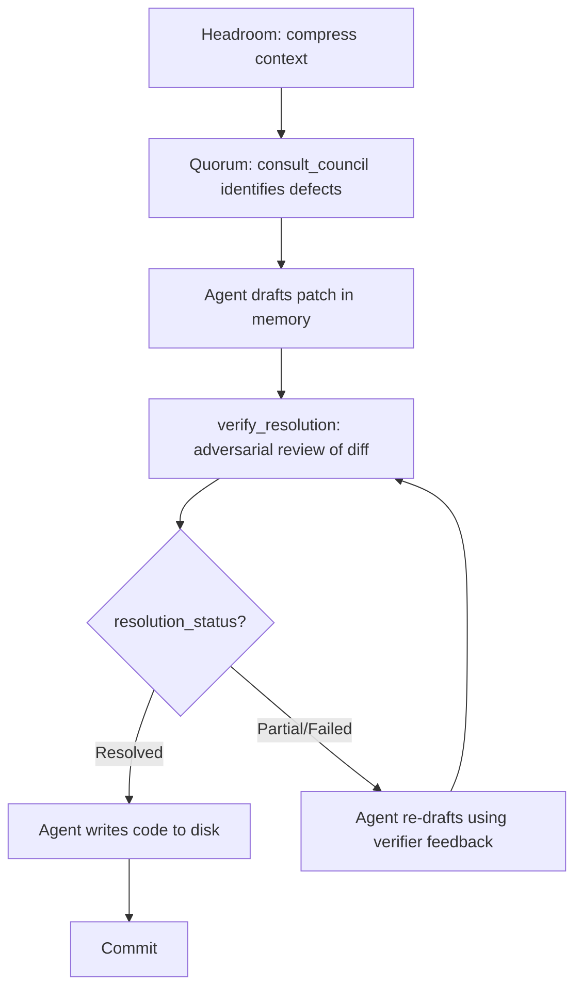

# Council Report: Best Complementary MCP Tool for Quorum

> **Run ID**: `council_run_1782327315301_a717720e`
> **Status**: `PARTIAL_SUCCESS` (2 of 3 providers responded in-band — ChatGPT, Qwen)
> **Late Addition**: Gemini's response provided separately by user

---

## Council Consensus: The Verification Gap

All three council members independently identified the same fundamental gap:

> **Quorum tells you what's wrong. Nothing in the ecosystem currently proves whether your fix is right.**

However, they diverged sharply on *how* to close that gap — revealing two distinct philosophies:

| Philosophy | Champion | Core Mechanism | Evidence Type |
|---|---|---|---|
| **Empirical execution** | ChatGPT, Qwen | Run the code in an isolated sandbox | Runtime test results, exit codes, regressions |
| **Semantic adversarial review** | Gemini | Multi-model review of the diff itself | LLM consensus on intent-vs-execution alignment |

---

## Proposal A: ProofRunner MCP *(ChatGPT, Qwen)*

### The Insight

An autonomous agent cannot determine whether a patch compiles, passes tests, or introduces regressions by reasoning harder. It must **execute** the repository under controlled conditions.

### Core Tools

#### `verify_change`

Establishes a baseline → executes a candidate change in isolation → compares results → detects regressions and flakiness → returns an evidence packet.

```json
{
  "repo_root": "/path/to/repo",
  "objective": "Fix race condition in session pool",
  "baseline": { "ref": "main" },
  "candidate": { "patch": "..." },
  "execution": {
    "discovery": "auto",
    "assertions": [
      { "type": "exit_code", "expected": 0 },
      { "type": "test_result", "expected": "all_pass" }
    ]
  },
  "policy": {
    "timeout_ms": 60000,
    "network": "deny",
    "max_output_bytes": 1048576
  },
  "flake_check": { "retries": 3, "require_consistent_runs": 3 }
}
```

**Output** includes: `verdict` (verified/rejected/inconclusive), baseline vs. candidate command results, test summaries, delta (newly passing/failing tests), flakiness detection, and a compact `evidence_packet` ready for another Quorum consultation.

#### `compare_candidates`

Accepts one baseline + multiple patch candidates. Runs all under identical conditions. Reports objective results (dominance, regressions, tradeoffs) — **does not declare a winner**.

#### (Optional) `minimize_failure`

Given a failed run, reduces it to a smaller command, test subset, or input fixture without rewriting production code.

### Strengths

- Provides ground truth no amount of LLM reasoning can produce
- Deterministic, reproducible evidence
- Evidence packets feed back into Quorum for deeper analysis
- Works regardless of test coverage quality

### Weaknesses

- Heavy implementation: workspace isolation, security sandboxing, test format parsing
- Requires infrastructure (Docker/Firecracker) for safe execution
- Cannot catch architectural drift or semantic violations that pass all existing tests
- Flaky test detection adds complexity

---

## Proposal B: Adversarial Patch Verifier *(Gemini)*

### The Insight

The critical vulnerability is **Agent Confirmation Bias**. When an autonomous agent drafts a patch based on a Quorum report, it struggles to impartially evaluate whether its own code successfully resolves the council's findings without introducing regressions. Prompting the agent to "review its own work" suffers from high LLM confirmation bias.

### Core Tool: `verify_resolution`

Reuses Quorum's proven multi-model fan-out to act as a "Pull Request Reviewer" for the autonomous agent.

**Input:**
```json
{
  "original_context": [
    { "path": "src/pool.ts", "content": "..." }
  ],
  "proposed_patch": "--- a/src/pool.ts\n+++ b/src/pool.ts\n@@ -42,7 +42,9 @@\n ...",
  "target_findings": [
    {
      "classification": "Confirmed defect",
      "severity": "High",
      "description": "Race condition in session pool acquire/release",
      "evidence": "from_orchestrator/engine/providerSessionPool.ts:42"
    }
  ]
}
```

**Output:**
```json
{
  "resolution_status": "Partial",
  "resolved_findings": [
    { "finding_index": 0, "confidence": "High", "reasoning": "..." }
  ],
  "introduced_risks": [
    {
      "classification": "Architectural risk",
      "severity": "Medium",
      "description": "Lock contention under high concurrency",
      "evidence": "proposed_patch:+7"
    }
  ],
  "verification_consensus": "3/4 models agree the patch is safe",
  "recommendation": "Re-draft with bounded wait on lock acquisition"
}
```

### The Workflow



### Strengths

- Lightweight: no sandbox, no Docker, no test infrastructure required
- Catches semantic/architectural violations that pass existing tests
- Leverages the proven Quorum multi-model engine directly
- Virtual patching (apply diff in-memory) avoids destructive disk changes
- Fast feedback loop — no build/test execution time

### Weaknesses

- Still LLM-based: susceptible to the same reasoning failures it tries to catch
- Cannot verify runtime behavior (compilation, test passage, performance)
- Adversarial prompting is fragile — models may still rubber-stamp
- No ground truth: a "3/4 consensus" doesn't mean the patch actually works

### Key Implementation Challenge

> [!WARNING]
> **Virtual Patching**: The tool must accurately apply unified diffs to the validated context in-memory to generate the "After" state for the council. This requires a robust diff parser and applicator — not trivial for edge cases (binary files, renames, mode changes).

> [!WARNING]
> **Adversarial Prompt Engineering**: The prompt must force the council into an adversarial stance, requiring them to actively search for edge cases and constraint violations rather than politely agreeing.

---

## Synthesis: Two Philosophies Compared

| Dimension | ProofRunner (Execution) | Adversarial Verifier (Semantic) |
|---|---|---|
| **Evidence type** | Ground truth (tests pass/fail) | Expert opinion (multi-model consensus) |
| **Catches** | Runtime failures, regressions, flakiness | Architectural drift, intent misalignment, constraint violations |
| **Misses** | Semantic issues that pass tests | Runtime failures in "correct-looking" code |
| **Setup cost** | High (sandbox, isolation, parsers) | Low (reuses Quorum engine) |
| **Execution time** | Slow (build + test) | Fast (LLM inference only) |
| **Confidence** | Deterministic | Probabilistic |
| **Infrastructure** | Docker/Firecracker/worktrees | None beyond existing Quorum |

> [!IMPORTANT]
> These are **complementary, not competing** proposals. The strongest ecosystem would include both:
> 1. `verify_resolution` as a fast, cheap pre-commit semantic gate (reusing Quorum's engine)
> 2. `verify_change` as a thorough post-draft empirical gate (new execution infrastructure)
>
> The agent would use the semantic verifier first (fast, catches obvious issues), then the execution verifier (slow, catches runtime issues) — similar to how CI has both linting and test stages.

---

## Additional Proposals (Lower Ranked)

### 📊 ImpactGraph MCP

**Gap**: Quorum assumes the agent selected the correct files. Wrong context boundaries cause every council member to reason from the same omission.

**Tool**: `map_change_impact` — calculates blast radius using import/call relationships, type references, package boundaries, test-to-source mappings, and git co-change history. Outputs a `quorum_context_manifest` that feeds directly into `consult_council.context.files`.

> [!NOTE]
> Ranked lower because the project already has a review-context generator, and this improves *inputs to reasoning* rather than closing the *verification gap*.

---

### 🏟️ PatchArena MCP

**Tool**: `evaluate_patch_set` — evaluates multiple agent-produced patches under identical conditions with benchmarks and compatibility checks. Essentially a specialization of ProofRunner's `compare_candidates`.

---

### 📋 Remediation Planner

**Tool**: `plan_remediation` — takes council findings + context, outputs ordered `AtomicStep` objects with `pre_conditions`, `post_conditions`, and `rollback_strategy`.

> [!WARNING]
> Achieving multi-model consensus on dependency graphs of changes is significantly harder than independent review or voting.

---

## Implementation Challenges Summary

| Challenge | ProofRunner | Adversarial Verifier |
|---|---|---|
| Workspace isolation | `git worktree` / Docker | N/A |
| Security sandboxing | Network deny, env allowlisting, secret redaction | N/A |
| Test format parsing | TAP, JUnit XML, Jest JSON, Vitest, Playwright | N/A |
| Virtual diff application | N/A | Unified diff parser + in-memory applicator |
| Adversarial prompting | N/A | Force adversarial stance, prevent rubber-stamping |
| Infrastructure vs. candidate failure | Must distinguish build failures from test failures | N/A |
| Flaky test detection | Bounded reruns | N/A |
| Output management | Bounded capture, Headroom integration | Structured JSON output |

---

## Open Questions

> [!IMPORTANT]
> **For ProofRunner:**
> - What sandbox technology is available? (Docker, Firecracker, none?)
> - What language ecosystems need support beyond TypeScript/Node.js?
> - How should repositories requiring networked dependencies be handled?
> - What's the acceptable compute budget per verification run?
>
> **For Adversarial Verifier:**
> - What diff format does the calling agent produce? (unified diff, search/replace blocks, full file replacements?)
> - How should the adversarial prompt be structured to prevent rubber-stamping?
> - Should the tool accept a `consult_council` run_id to automatically pull findings, or require them to be passed explicitly?
>
> **For both:**
> - Does the coding agent have permission to expose a repository root to an MCP server?
> - Which tool should be built first? (Gemini's verifier is faster to ship; ProofRunner has higher ceiling)

---

## Suggested Build Order

1. **`verify_resolution`** (Adversarial Verifier) — fast to build by extending the Quorum engine, provides immediate value, low infrastructure requirements
2. **`verify_change`** (ProofRunner) — higher ceiling, requires sandbox infrastructure, provides ground truth the semantic verifier cannot
3. **`compare_candidates`** — natural extension of ProofRunner once `verify_change` works
4. **`map_change_impact`** — improves context quality for all other tools
