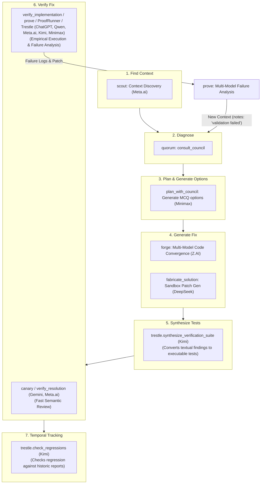

# Council Report: Best Complementary MCP Tool for Quorum

> **Run ID**: `council_run_1782327315301_a717720e` (original 2/3 in-band)
> **Additional Responses**: Gemini, DeepSeek, Meta.ai, Kimi, Z.AI, and Minimax (provided separately)
> **Total Council Members**: 8 (ChatGPT, Qwen, Gemini, DeepSeek, Meta.ai, Kimi, Z.AI, Minimax)

---

## Universal Consensus

All eight council members independently identified the same fundamental gap from the same line of evidence:

> `council.ts:8` — *"Analyze the request and repository context independently. Do not write final code."*
> `README.md:5` — *"coordinates structured reviews... writes report artifacts"* (no execution)

**Quorum excels at diagnosis, but has no mechanism to turn those diagnoses into verified fixes. An autonomous agent is forced to implement changes blindly, then guess why tests fail using its own single-model reasoning.**

The council has converged on a multi-stage pipeline to close this gap. Where the members differ is which stage of the lifecycle they prioritize:



---

## Seven Core Stages

| Philosophy | Champions | Tool | Primary Mechanism | Key Value |
|---|---|---|---|---|
| 🧭 **Discover** | Meta.ai | `scout` | Context discovery and relevance ranking | Minimizes "Unverifiable" findings from missed files |
| 📋 **Plan** | Minimax | `plan_with_council` | Phase 1: generate options; Phase 2: vote via MCQ | Discovers options the agent hasn't considered |
| 🔨 **Generate** | DeepSeek, Z.AI | `fabricate_solution` / `forge` | Multi-model patch generation + convergence analysis | Solves single-model implementation blind spot |
| 🔍 **Review** | Gemini, Meta.ai | `verify_resolution` / `canary` | Multi-model adversarial diff review | Fast, cheap gate; catches semantic drift |
| 📝 **Synthesize** | Kimi | `trestle.synthesize_verification_suite` | Translates textual finding recommendations into code | Bridges the gap between text reports and code |
| ⚡ **Execute** | ChatGPT, Qwen, Meta.ai, Kimi, Minimax | `verify_implementation` / `prove` / `trestle.verify_implementation` | Sandbox test execution + multi-model failure diagnostics | Ground truth execution + root-cause analysis |
| 📜 **Ledger** | Kimi | `trestle.check_regressions` | Compares current repository state with SQLite reports | Prevents regression reintroduction over time |

---

## Proposal A: ProofRunner, Prove, & verify_implementation *(ChatGPT, Qwen, Meta.ai, Minimax)*

### The Insight
An autonomous agent cannot determine whether a patch compiles, passes tests, or breaks regressions by reasoning harder. It must **execute** code. Furthermore, Meta.ai and Minimax point out that if execution fails, the agent shouldn't just look at raw terminal stderr. It needs **multi-model interpretation of identical failures** to diagnose *why* it failed.

### Core Tools

#### `prove.run_verification` / `verify_implementation`
Establishes a baseline, applies the patch in a sandboxed container, and runs the test suite. If tests fail, it fans the execution outputs (smart-truncated and redacted) to the council models to analyze the failure.

*   **Input Schema:** `{ patch: string, test_commands: string[], environment: object, consult_council_on_failure: boolean, providers?: string[] }`
*   **Output Schema:** `{ status: "pass"|"fail", duration_ms: number, failed_tests: Array<{name, message, stack}>, council_diagnosis?: {run_id: string, report_path: string, findings: Array<{classification, root_cause, evidence}>} }`

---

## Proposal B: Adversarial Patch Verifier / Canary *(Gemini, Meta.ai)*

### The Insight
Agents suffer from **Confirmation Bias**. When an agent writes a patch, it struggles to evaluate its own work objectively. Self-review prompts usually rubber-stamp changes. A lightweight, fast, semantic-only check is needed before committing to expensive sandboxed execution.

### Core Tools

#### `verify_resolution` / `canary.assess`
Applies the patch in-memory and forces the council into an adversarial stance to flag security, performance, or API regression risks.

*   **Input Schema:** `{ original_context: Array<{path, content}>, proposed_patch: string, target_findings: Array<{classification, description}> }`
*   **Output Schema:** `{ resolution_status: string, introduced_risks: Array<{classification, severity, description}>, verification_consensus: string }`

---

## Proposal C: fabricate_solution *(DeepSeek)*

### The Insight
The hardest step for an agent isn't reviewing a patch—it's writing the patch. By fanning out the findings to multiple providers, generating candidate patches, and running them through tests, `fabricate_solution` automatically synthesizes verified patches.

### Core Tool: `synthesize_patch`
Consumes a Quorum run ID, generates candidates across multiple models, and returns the patch that passes the test suite.

---

## Proposal D: Scout MCP *(Meta.ai)*

### The Insight
If the agent feeds Quorum the wrong files, the council will output "Unverifiable" findings or miss transitive bugs. Asking agents to manually find all relevant files results in either over-inclusion (wasted context window) or under-inclusion (missed context).

### Core Tool: `scout.discover_context`
Performs semantic code search, traverses call graphs, and asks a fast provider to rank files based on relevance to a question before Quorum runs.

---

## Proposal E: Trestle — Test Synthesis & Temporal Ledger *(Kimi)*

### The Insight
Quorum's reviewer contract forces models to provide **textual validation tests** for each finding, but these remain natural-language descriptions. `trestle` bridges analysis to verification by generating executable test code from these descriptions and tracking defects across time to prevent regressions.

### Core Tools

#### `trestle.synthesize_verification_suite`
Fans out to multiple models: *"Given finding X (and its textual validation test recommendation) and this codebase, write an executable test that catches this defect."*

#### `trestle.verify_implementation`
Applies a diff in a sandbox, runs the synthesized test suite, and reports finding resolution status (resolved, partial, failed) along with regression risks.

#### `trestle.check_regressions`
Compares the current repository state against SQLite historical report records to check if previously fixed findings have been reintroduced.

---

## Proposal F: Forge — Multi-Model Implementation Synthesizer *(Z.AI)*

### The Insight
When an agent implements a fix, it drops back down to single-model reasoning, abandoning Quorum's multi-model safety net right where errors are most expensive. **Forge** generates candidate patches independently using 3-4 different providers, aligns them via AST/line-level diffs, and evaluates convergence. If all models implement the fix identically, confidence is high; if they diverge, the divergence indicates high-risk logic gaps that require agent or council attention.

### Core Tool: `synthesize_implementation`
Generates independent code solutions from multiple models, analyzes their differences, and highlights consensus or risk flags.

---

## Proposal G: plan_with_council *(Minimax)*

### The Insight
Quorum MCQ (`consult_council_mcq`) requires predefined options. If the agent does not understand the bug's solution space, it cannot construct options for the council to vote on. **`plan_with_council`** uses the council to first *generate* the option space, deduplicates the proposals, and then runs MCQ to select the best plan.

### Core Tool: `plan_with_council`
Orchestrates option generation, merges duplicate choices, and votes on them.

*   **Input Schema:** `{ goal: string, constraints?: string, option_count: number, vote: boolean }`
*   **Output Schema:** `{ generated_options: Array<{id, description}>, vote_distribution: Record<string, number>, final_plan: string }`

---

## Security & Hardening Requirements

Minimax highlighted critical architectural risks that must be addressed when building executing tools:

> [!CAUTION]
> **1. Command Injection Boundary:**
> Since `verify_implementation` accepts a command string from the agent (e.g. `verify_implementation.command`), a compromised or misbehaving agent could pass destructive commands (e.g. `rm -rf /` or env harvesting).
> 
> *Mitigation*: 
> - Execute verification exclusively within a temporary container (Docker/WASM sandbox).
> - Implement a strict command allowlist (e.g. only `npm test`, `vitest run`, `pytest`).
> - Restrict shell evaluation and escape arguments safely.

> [!WARNING]
> **2. Secrets Redaction in Logs:**
> Test failure logs or application outputs passed back to external model endpoints for failure analysis could contain sensitive API keys (e.g. from `.env.test`), DB connections, or PII.
> 
> *Mitigation*: 
> - Pass all raw stdout/stderr through regex filter pools targeting known token formats, private keys, and environment variable values before fanning out to providers.

---

## Synthesis & Comparison Matrix

| Dimension | `scout` (Discover) | `plan_with_council` (Plan) | `forge` (Generate - Semantic) | `fabricate_solution` (Generate - Execution) | `verify_resolution` / `canary` (Review) | `trestle` (Test Synthesis) | `verify_implementation` / `prove` (Execute) | `trestle.check_regressions` (Ledger) |
|---|---|---|---|---|---|---|---|---|
| **Objective** | Find files | Generate MCQ options | Multi-model code gen | Single-model + sandbox run | Review patch semantically | Write tests from findings | Run tests & diagnose | Prevent old regressions |
| **Evidence** | Call graphs | Merged options | Convergence / divergence | Unified diff + test results | Multi-model consensus | Executable tests | Empirical test results | SQLite history |
| **Sandbox?** | No | No | No | Yes | No | No | Yes | No |
| **Reuses Quorum?**| No | Yes (calls MCQ) | Yes (provider layer) | Yes (uses output) | Yes (multi-model) | Yes (uses output) | Yes (analyzes failures) | Yes (uses SQLite) |
| **Time to MVP** | 2-3 Days | 1-2 Days | 2-3 Days | 2-3 Weeks | 2-3 Days | 5-7 Days | 2-3 Weeks | 3-4 Days |

---

## Final Recommended Build Order (The "Closed Loop" Pipeline)

We recommend building the tools in the following order:

```
[Scout] ➔ [Quorum] ➔ [plan_with_council] ➔ [Forge] ➔ [Trestle (Test Synthesis)] ➔ [verify_implementation (Execute & Diagnose)] ➔ [Trestle (Regression Ledger)]
```

1. **`verify_implementation` / `prove`** — *Highest Priority (Empirical execution & failure analysis)*. Provides absolute ground truth. Must be coupled with a sandboxed runner and logs-redaction pipeline.
2. **`forge`** — *High Priority (Bridges options to code without single-model bias)*. Reuses Quorum's adapter infrastructure, making it fast to implement (~2-3 days).
3. **`trestle.synthesize_verification_suite`** — *High Priority (Bridges text report recommendations to code)*. Solves the issue where findings propose tests, but agents have to write them manually.
4. **`scout`** — *Medium Priority (Pre-Quorum context discovery)*. Eliminates context selection errors and false-positive defect reports.
5. **`plan_with_council`** — *Medium Priority (MCQ enhancer)*. Simplifies plan discovery for complex goals.
6. **`trestle.check_regressions`** — *Medium Priority (Durable history tracker)*. Prevents reintroduction of defects over time.
