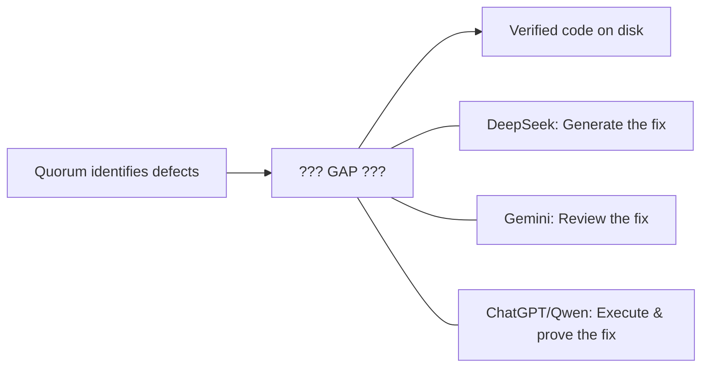
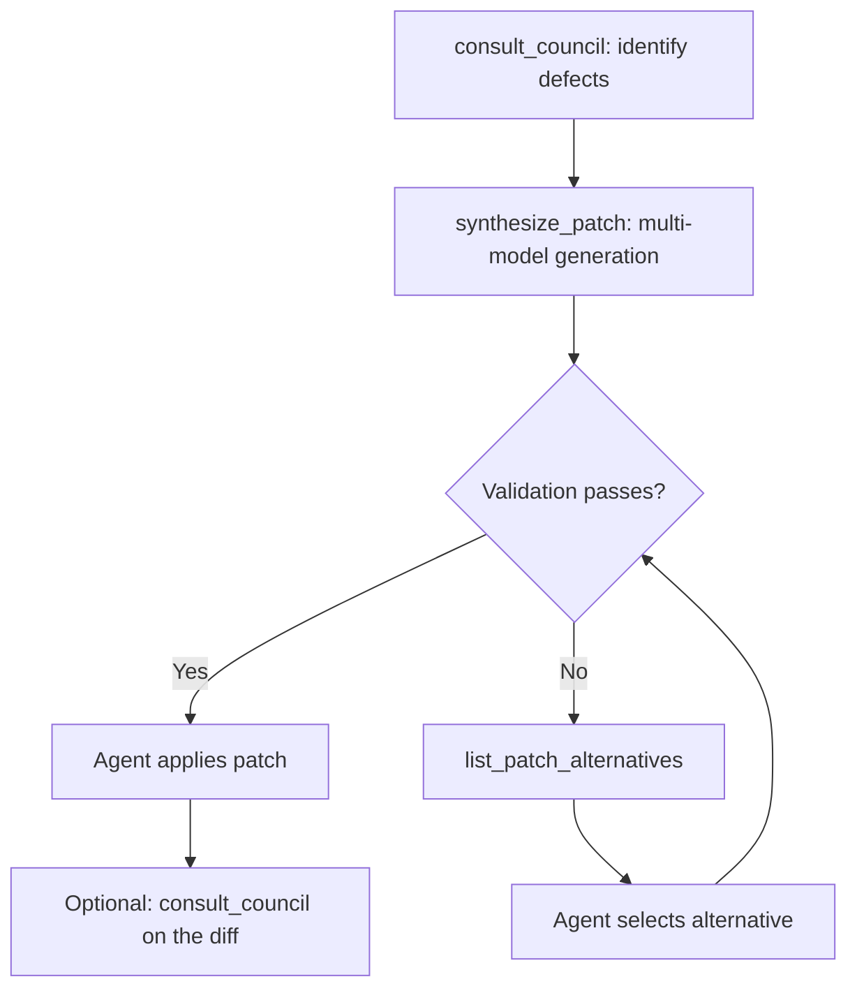
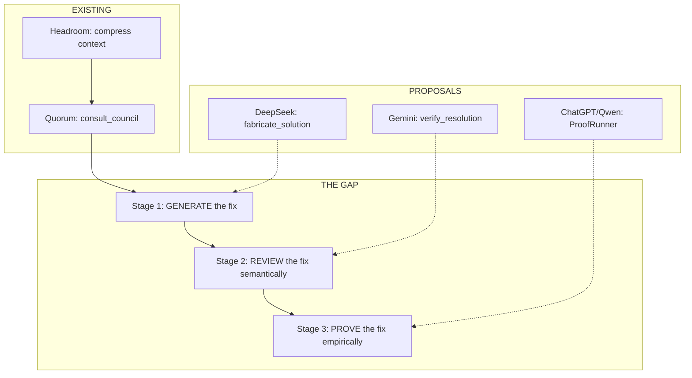

# Council Report: Best Complementary MCP Tool for Quorum

> **Run ID**: `council_run_1782327315301_a717720e` (original 2/3 in-band)
> **Additional responses**: Gemini and DeepSeek provided separately
> **Total council members**: 4 (ChatGPT, Qwen, Gemini, DeepSeek)

---

## Universal Consensus

All four council members independently identified the same fundamental gap from the same line of evidence:

> `council.ts:8` — *"Do not write final code."*

**Quorum diagnoses. Nothing in the ecosystem currently helps turn that diagnosis into a verified fix.**

Where they diverge is *which part* of that gap matters most:



---

## Three Philosophies

| Philosophy | Champion(s) | Tool | Mechanism | Key Strength |
|---|---|---|---|---|
| 🔨 **Generate** | DeepSeek | `fabricate_solution` | Multi-model patch generation + sandbox testing | Removes the agent from the hardest step |
| 🔍 **Review** | Gemini | `verify_resolution` | Multi-model adversarial diff review | Fast, lightweight, catches semantic issues |
| ⚡ **Execute** | ChatGPT, Qwen | `verify_change` | Sandboxed test execution + baseline comparison | Ground truth no LLM can produce |

---

## Proposal A: ProofRunner MCP *(ChatGPT, Qwen)*

### The Insight

An autonomous agent cannot determine whether a patch compiles, passes tests, or introduces regressions by reasoning harder. It must **execute** the repository under controlled conditions.

### Core Tools

#### `verify_change`

Establishes a baseline → executes a candidate change in isolation → compares results → detects regressions and flakiness → returns an evidence packet.

```json
{
  "repo_root": "/path/to/repo",
  "objective": "Fix race condition in session pool",
  "baseline": { "ref": "main" },
  "candidate": { "patch": "..." },
  "execution": {
    "discovery": "auto",
    "assertions": [
      { "type": "exit_code", "expected": 0 },
      { "type": "test_result", "expected": "all_pass" }
    ]
  },
  "policy": {
    "timeout_ms": 60000,
    "network": "deny",
    "max_output_bytes": 1048576
  },
  "flake_check": { "retries": 3, "require_consistent_runs": 3 }
}
```

**Output**: `verdict` (verified/rejected/inconclusive), baseline vs. candidate results, test delta, flakiness detection, and a compact `evidence_packet` for Quorum follow-up.

#### `compare_candidates`

One baseline + multiple patches. Identical conditions. Objective results — **no winner declared**.

#### (Optional) `minimize_failure`

Reduces a failed run to a smaller command/test subset.

### Strengths & Weaknesses

| ✅ Strengths | ❌ Weaknesses |
|---|---|
| Ground truth no LLM can produce | Heavy: sandbox, Docker, test parsers |
| Deterministic, reproducible | Can't catch architectural drift passing tests |
| Evidence feeds back into Quorum | Slow (build + test execution) |
| Works regardless of test coverage quality | Requires infrastructure |

---

## Proposal B: Adversarial Patch Verifier *(Gemini)*

### The Insight

The critical vulnerability is **Agent Confirmation Bias**. When an agent drafts a patch based on a Quorum report, it can't impartially evaluate its own work. Self-reflection prompts suffer from high LLM confirmation bias. The fix: use *other* models as adversarial reviewers.

### Core Tool: `verify_resolution`

Acts as a "Pull Request Reviewer" — applies the diff in-memory and forces the council into an adversarial stance.

**Input:**
```json
{
  "original_context": [
    { "path": "src/pool.ts", "content": "..." }
  ],
  "proposed_patch": "--- a/src/pool.ts\n+++ b/src/pool.ts\n@@ ...",
  "target_findings": [
    {
      "classification": "Confirmed defect",
      "severity": "High",
      "description": "Race condition in session pool acquire/release",
      "evidence": "providerSessionPool.ts:42"
    }
  ]
}
```

**Output:**
```json
{
  "resolution_status": "Partial",
  "resolved_findings": [ { "finding_index": 0, "confidence": "High" } ],
  "introduced_risks": [
    {
      "classification": "Architectural risk",
      "severity": "Medium",
      "description": "Lock contention under high concurrency"
    }
  ],
  "verification_consensus": "3/4 models agree the patch is safe",
  "recommendation": "Re-draft with bounded wait on lock acquisition"
}
```

### Strengths & Weaknesses

| ✅ Strengths | ❌ Weaknesses |
|---|---|
| Lightweight — no sandbox/Docker needed | Still LLM-based — can rubber-stamp |
| Fast feedback loop (no build time) | No ground truth: consensus ≠ correctness |
| Catches semantic/architectural drift | Can't verify compilation or runtime behavior |
| Extends existing Quorum engine directly | Adversarial prompting is fragile |

---

## Proposal C: fabricate_solution *(DeepSeek)*

### The Insight

The agent's hardest remaining step isn't *reviewing* its fix — it's *generating* the fix in the first place. Quorum proved multi-model independence is valuable for analysis. The same approach should apply to **code generation**: fan out to multiple providers, each independently produces a patch, then validate empirically.

### Core Tools

#### `synthesize_patch`

```json
{
  "council_run_id": "council_run_1782327315301_a717720e",
  "target_files": [
    { "path": "src/pool.ts", "content": "..." }
  ],
  "validation_commands": ["npm test", "npx tsc --noEmit"],
  "style_constraints": "Follow existing patterns. No new dependencies."
}
```

**Output:**
```json
{
  "patch": "--- a/src/pool.ts\n+++ b/src/pool.ts\n@@ ...",
  "explanation": "Addressed Finding 1 (race condition) by...",
  "validation_results": [
    { "command": "npm test", "exit_code": 0, "output": "..." },
    { "command": "npx tsc --noEmit", "exit_code": 0 }
  ],
  "confidence": 0.85,
  "models_agreeing": 3,
  "models_total": 4
}
```

#### `list_patch_alternatives`

Returns multiple ranked patches when models diverge — lets the agent choose.

### Workflow



### Strengths & Weaknesses

| ✅ Strengths | ❌ Weaknesses |
|---|---|
| Addresses the *hardest* step (correct code gen) | Overlaps with what the agent already does |
| Multi-model diversity reduces hallucination risk | Risk of duplicating Quorum's MCQ voting |
| Includes empirical validation (sandbox execution) | Requires same sandbox infrastructure as ProofRunner |
| Direct artifact output (a patch) | Multi-model code *equivalence* detection is hard |

### DeepSeek's Self-Critique (Finding 5)

> [!WARNING]
> If `fabricate_solution` presents multiple patches and asks providers to vote, it duplicates Quorum's MCQ mechanism. Aggregation must be through **automated testing and deterministic merging** (the patch that passes all tests), not through another voting scheme.

---

## Full Synthesis

### Mapping to the Agent Workflow

Each proposal addresses a different stage of the gap between "Quorum report" and "verified code on disk":



### The Complete Pipeline (All Three)

If you built all three, the ideal autonomous workflow would be:

| Stage | Tool | Purpose | Speed |
|---|---|---|---|
| 0. Context | Headroom | Compress context | Fast |
| 1. Diagnose | Quorum `consult_council` | Identify defects | Medium |
| 2. Generate | `synthesize_patch` | Multi-model patch creation | Medium |
| 3. Semantic check | `verify_resolution` | Adversarial diff review | Fast |
| 4. Empirical proof | `verify_change` | Sandboxed test execution | Slow |
| 5. Decide | Quorum `consult_council_mcq` | Vote on residual tradeoffs | Medium |

### But You Can Only Build One First

> [!IMPORTANT]
> **The critical question: which stage fails most often for your agents today?**
>
> - If agents **write bad code** → build `fabricate_solution` (Stage 2)
> - If agents **write plausible-looking but subtly wrong code** → build `verify_resolution` (Stage 3)
> - If agents **can't tell whether their code actually works** → build ProofRunner (Stage 4)

---

## Comparison Matrix

| Dimension | `fabricate_solution` | `verify_resolution` | ProofRunner |
|---|---|---|---|
| **What it does** | Generates patches from findings | Reviews patches adversarially | Executes patches in sandbox |
| **Evidence type** | Generated code + test results | Multi-model consensus | Ground truth (tests pass/fail) |
| **Reuses Quorum engine** | Yes (adapter pattern) | Yes (multi-model fan-out) | No (new execution engine) |
| **Requires sandbox** | Yes | No | Yes |
| **Build complexity** | High | Low–Medium | High |
| **Time to MVP** | Weeks | Days | Weeks |
| **Unique value** | Multi-model code gen | Confirmation bias breaker | Deterministic proof |
| **Duplication risk** | May overlap agent's own generation | May overlap self-review | None — new capability |
| **Catches** | Bad implementations at source | Semantic drift, constraint violations | Runtime failures, regressions |
| **Misses** | Subtle issues all models agree on | Anything that "looks right" | Issues passing all existing tests |

---

## Suggested Build Order

### Option 1: Speed-first (ship value fastest)
1. **`verify_resolution`** — extends Quorum engine, no sandbox, ships in days
2. **ProofRunner `verify_change`** — new infrastructure, highest ceiling
3. **`fabricate_solution`** — builds on ProofRunner's sandbox

### Option 2: Impact-first (maximize agent autonomy)
1. **`fabricate_solution`** — addresses the hardest step
2. **ProofRunner `verify_change`** — validates the generated patches
3. **`verify_resolution`** — fast pre-check gate before expensive execution

### Option 3: Pragmatic hybrid
1. **`verify_resolution`** — fast, cheap, immediately useful
2. **ProofRunner `verify_change`** — adds ground truth
3. Integrate generation into ProofRunner's `compare_candidates` rather than building a separate `fabricate_solution`

---

## Open Questions

> [!IMPORTANT]
> **Strategic:**
> - Which stage of the gap fails most often for your agents today?
> - Is the goal to make agents better at writing code, or better at validating code they already write?
> - How much infrastructure investment is acceptable? (Docker required for ProofRunner and fabricate_solution)
>
> **Technical:**
> - What diff format does the calling agent produce?
> - Should tools accept a `council_run_id` to pull findings automatically?
> - What sandbox technology is available?
> - What language ecosystems beyond TypeScript/Node.js?
>
> **Design:**
> - Should `fabricate_solution` replace the agent's own code generation, or supplement it?
> - How to aggregate multi-model code output without reimplementing MCQ voting?
> - Should `verify_resolution` share Quorum's provider pool or run independently?
