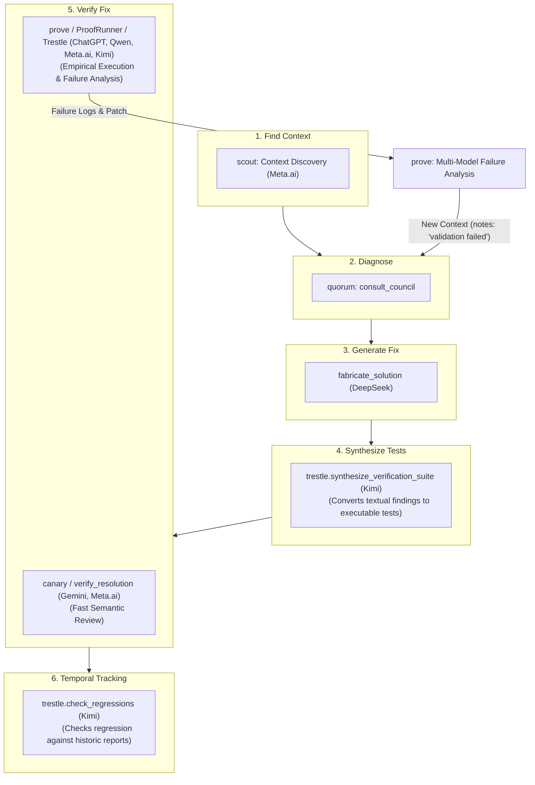

# Council Report: Best Complementary MCP Tool for Quorum

> **Run ID**: `council_run_1782327315301_a717720e` (original 2/3 in-band)
> **Additional Responses**: Gemini, DeepSeek, Meta.ai, and Kimi (provided separately)
> **Total Council Members**: 6 (ChatGPT, Qwen, Gemini, DeepSeek, Meta.ai, Kimi)

---

## Universal Consensus

All six council members independently identified the same fundamental gap from the same line of evidence:

> `council.ts:8` — *"Do not write final code."*
> `README.md:5` — *"coordinates structured reviews... writes report artifacts"* (no execution)

**Quorum excels at diagnosis, but has no mechanism to turn those diagnoses into verified fixes. An autonomous agent is forced to implement changes blindly, then guess why tests fail using its own single-model reasoning.**

The council has converged on a multi-stage pipeline to close this gap. Where the members differ is which stage of the lifecycle they prioritize:



---

## Six Core Philosophies

| Philosophy | Champions | Tool | Primary Mechanism | Key Value |
|---|---|---|---|---|
| 🧭 **Discover** | Meta.ai | `scout` | Context discovery and relevance ranking | Minimizes "Unverifiable" findings from missed files |
| 🔨 **Generate** | DeepSeek | `fabricate_solution` | Multi-model patch generation + test runs | Offloads implementation completely |
| 🔍 **Review** | Gemini, Meta.ai | `verify_resolution` / `canary` | Multi-model adversarial diff review | Fast, cheap gate; catches semantic drift |
| 📝 **Synthesize** | Kimi | `trestle.synthesize_verification_suite` | Translates textual finding recommendations into code | Bridges the gap between text reports and code |
| ⚡ **Execute** | ChatGPT, Qwen, Meta.ai, Kimi | `verify_change` / `prove` / `trestle.verify_implementation` | Sandbox test execution + multi-model failure diagnostics | Ground truth execution + root-cause analysis |
| 📜 **Ledger** | Kimi | `trestle.check_regressions` | Compares current repository state with SQLite reports | Prevents regression reintroduction over time |

---

## Proposal A: ProofRunner & Prove *(ChatGPT, Qwen, Meta.ai)*

### The Insight
An autonomous agent cannot determine whether a patch compiles, passes tests, or breaks regressions by reasoning harder. It must **execute** code. Furthermore, Meta.ai points out that if execution fails, the agent shouldn't just look at raw terminal stderr. It needs **multi-model interpretation of identical failures** to diagnose *why* it failed.

### Core Tools

#### `prove.run_verification` / `verify_change`
Establishes a baseline, applies the patch in a sandboxed container, and runs the test suite. If tests fail, it fans the execution outputs to the council models to analyze the failure.

*   **Input Schema:** `{ patch: string, test_commands: string[], environment: object, council_providers?: string[], focus?: string }`
*   **Output Schema:** `{ execution: {passed: boolean, failed_tests: string[], stdout: string, stderr: string}, council_interpretation: [{provider: string, hypothesis: string, root_cause_classification: string, suggested_fix: string}], consensus: {agreement_score: number, top_hypothesis: string} }`

### Strengths & Weaknesses
*   **Strengths:** Creates empirical ground truth. Multi-model failure analysis translates raw stack traces into actionable fixes.
*   **Weaknesses:** Heavy build/run times. Requires sandbox orchestration (Docker) to isolate test runs.

---

## Proposal B: Adversarial Patch Verifier / Canary *(Gemini, Meta.ai)*

### The Insight
Agents suffer from **Confirmation Bias**. When an agent writes a patch, it struggles to evaluate its own work objectively. Self-review prompts usually rubber-stamp changes. A lightweight, fast, semantic-only check is needed before committing to expensive sandboxed execution.

### Core Tools

#### `verify_resolution` / `canary.assess`
Applies the patch in-memory and forces the council into an adversarial stance to flag security, performance, or API regression risks.

*   **Input Schema:** `{ original_context: Array<{path, content}>, proposed_patch: string, target_findings: Array<{classification, description}> }`
*   **Output Schema:** `{ resolution_status: string, introduced_risks: Array<{classification, severity, description}>, verification_consensus: string }`

### Strengths & Weaknesses
*   **Strengths:** Zero sandbox dependencies. Extremely fast. Catches high-level logic and API contract violations that simple tests miss.
*   **Weaknesses:** No ground truth. If all models share a blind spot, they will miss compilation errors or subtle runtime exceptions.

---

## Proposal C: fabricate_solution *(DeepSeek)*

### The Insight
The hardest step for an agent isn't reviewing a patch—it's writing the patch. By fanning out the findings to multiple providers, generating candidate patches, and running them through tests, `fabricate_solution` automatically synthesizes verified patches.

### Core Tool: `synthesize_patch`
Consumes a Quorum run ID, generates candidates across multiple models, and returns the patch that passes the test suite.

*   **Input Schema:** `{ council_run_id: string, target_files: Array<{path}>, validation_commands: string[] }`
*   **Output Schema:** `{ patch: string, explanation: string, validation_results: Array<{command, exit_code}> }`

### Strengths & Weaknesses
*   **Strengths:** Highest autonomy. The agent goes directly from a diagnosis to a working patch on disk.
*   **Weaknesses:** High token consumption. Overlaps with the agent's core capability (writing code).

---

## Proposal D: Scout MCP *(Meta.ai)*

### The Insight
If the agent feeds Quorum the wrong files, the council will output "Unverifiable" findings or miss transitive bugs. Asking agents to manually find all relevant files results in either over-inclusion (wasted context window) or under-inclusion (missed context).

### Core Tool: `scout.discover_context`
Performs semantic code search, traverses call graphs, and asks a fast provider to rank files based on relevance to a question before Quorum runs.

*   **Input Schema:** `{ question: string, repo_snapshot_digest: string, max_files: number }`
*   **Output Schema:** `{ ranked_files: Array<{path, relevance_score, reasoning}>, consensus_context: {files: string[]}, divergence: string[] }`

### Strengths & Weaknesses
*   **Strengths:** Directly reduces Quorum's false-negative and "Unverifiable" rates. Optimizes token usage.
*   **Weaknesses:** Does not solve the execution verification problem. Best used as a front-end pre-processor.

---

## Proposal E: Trestle — Test Synthesis & Temporal Ledger *(Kimi)*

### The Insight
Quorum's reviewer contract forces models to provide **textual validation tests** for each finding, but these remain natural-language descriptions. `trestle` bridges analysis to verification by generating executable test code from these descriptions and tracking defects across time to prevent regressions.

### Core Tools

#### `trestle.synthesize_verification_suite`
Fans out to multiple models: *"Given finding X (and its textual validation test recommendation) and this codebase, write an executable test that catches this defect."*

*   **Input Schema:**
    ```json
    {
      "quorum_report_artifact_path": "string",
      "repository_context": {
        "files": [{"path": "string", "content": "string"}]
      },
      "test_framework": "jest"
    }
    ```
*   **Output Schema:**
    ```json
    {
      "test_files": [
        {
          "path": "string",
          "content": "string",
          "target_finding": "finding_id_0"
        }
      ],
      "uncovered_findings": []
    }
    ```

#### `trestle.verify_implementation`
Applies a diff in a sandbox, runs the synthesized test suite, and reports finding resolution status (resolved, partial, failed) along with regression risks.

#### `trestle.check_regressions`
Compares the current repository state against SQLite historical report records to check if previously fixed findings have been reintroduced.

### Strengths & Weaknesses
*   **Strengths:** Directly leverages Quorum's unique output format (textual validation tests) rather than discarding it. Prevents temporal regression loops.
*   **Weaknesses:** Requires sandbox environments to execute the test suite safely.

---

## Analysis of Kimi's Finding 6: A Meta-Analytical Case Study

Kimi flagged a likely defect in `from_orchestrator/mcp/server.ts:69` stating that `consultCouncilMcqSchema` is referenced but never defined. 

**Verification:** In the full workspace, `consultCouncilMcqSchema` is defined on line 180 of `from_orchestrator/mcp/server.ts`. 

> [!NOTE]
> **Key Insight:** This finding was a false positive caused by incomplete/truncated context provided during Kimi's analysis. 
> 
> This is a **live demonstration of why Proposal D (Scout) is critical**: when an autonomous agent is forced to select context files without a structured layout explorer or dynamic indexer, it truncates code and misses symbols, leading models to hallucinate missing code definitions.

---

## Synthesis & Comparison Matrix

| Dimension | `scout` (Discover) | `fabricate_solution` (Generate) | `verify_resolution` / `canary` (Review) | `trestle.synthesize_verification_suite` (Synthesize) | `prove` / ProofRunner / Trestle (Execute) | `trestle.check_regressions` (Ledger) |
|---|---|---|---|---|---|---|
| **Objective** | Find relevant files | Write the code patch | Review patch semantically | Generate test code from textual findings | Run tests & analyze failures | Prevent historical regressions |
| **Evidence Type** | Path relevance & call graphs | Unified diff + test results | Multi-model consensus review | Executable test suite | Empirical execution results | Schema/finding history comparison |
| **Sandbox Required?**| No | Yes | No | No | Yes | No |
| **Reuses Quorum?** | No (pre-processor) | Yes (uses council output) | Yes (multi-model reviews) | Yes (uses textual findings) | Yes (analyzes failures) | Yes (uses SQLite records) |
| **Time to MVP** | 2-3 Days | 2-3 Weeks | 2-3 Days | 5-7 Days | 2-3 Weeks | 3-4 Days |
| **Catches** | Missing context, token waste | Development velocity blocks | Semantic bugs, api breaking changes | Gap between text & code | Compilation errors, regressions | Reintroduced historical defects |

---

## Final Recommended Build Order (The "Closed Loop" Pipeline)

We recommend building the tools in the following order to maximize agent capabilities:

```
[Scout] ➔ [Quorum] ➔ [Agent] ➔ [Trestle (Test Synthesis)] ➔ [Prove/ProofRunner (Execute & Diagnose)] ➔ [Trestle (Regression Ledger)]
```

1. **`prove` (Prove/ProofRunner)** — *Highest Priority (Empirical execution & multi-model failure interpretation)*. Creates the baseline execution engine.
2. **`trestle.synthesize_verification_suite`** — *High Priority (Bridges text report recommendations to code)*. Solves the issue where findings propose tests, but agents have to write them manually.
3. **`scout`** — *Medium Priority (Pre-Quorum context discovery)*. Eliminates context selection errors and false-positive defect reports (as demonstrated by Kimi's Finding 6).
4. **`trestle.check_regressions`** — *Medium Priority (Durable history tracker)*. Prevents reintroduction of defects over time.
5. **`canary` / `verify_resolution`** — *Low Priority (Semantic filter)*. Lightweight pre-check gate.
